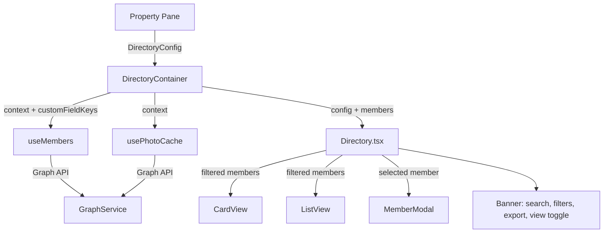

# Maecia Directory

A configurable SharePoint Framework (SPFx) web part that turns any SharePoint page into a modern, searchable directory of your Microsoft 365 users.

[](./LICENSE)
[](https://learn.microsoft.com/sharepoint/dev/spfx/sharepoint-framework-overview)
[](https://nodejs.org)
[](https://reactjs.org)

---

## Table of contents

- [Overview](#overview)
- [Features](#features)
- [Demo](#demo)
- [Screenshots](#screenshots)
- [Requirements](#requirements)
- [Getting started](#getting-started)
- [Installation and deployment](#installation-and-deployment)
- [User manual](#user-manual)
- [Administrator manual](#administrator-manual)
- [Configuration reference](#configuration-reference)
- [Technical specification](#technical-specification)
- [Build, test and CI](#build-test-and-ci)
- [Permissions and privacy](#permissions-and-privacy)
- [Troubleshooting](#troubleshooting)
- [Support](#support)
- [License](#license)

---

## Overview

**Maecia Directory** reads the active members of a Microsoft 365 tenant through Microsoft Graph and displays them on any SharePoint page. Page authors configure, from the property pane, which fields appear in each of the three views (card, list and detail panel), which filters are available and how the directory is sorted.

End users get a fast, responsive directory with real-time search, multi-select filters, contact shortcuts for Microsoft Teams and Outlook, and a CSV export that respects the active search and filters.

The solution contains a **single web part**, is deployed tenant-wide (`skipFeatureDeployment: true`) and is ready to be published to the **Microsoft Marketplace / SharePoint Store**.

---

## Features

| Feature | Description | Audience |
| --- | --- | --- |
| **Card view (trombinoscope)** | Responsive grid of member cards with photo, name and contact actions, with a pager. | End user |
| **List view** | Table with sortable columns, configurable columns and a pager. | End user |
| **Pagination** | Configurable page size (12, 24, 36 or 48; default 24) with a pager at the bottom of both views. | Administrator |
| **Real-time search** | Free-text search across name, first name, job title, department, email, phone, manager and custom fields, ranked by relevance. | End user |
| **Multi-select filters** | Up to 3 admin-defined filters with multi-value selection, combined with an AND logic and with the search. | End user |
| **Detail panel** | Modal with the full profile, configurable fields and contact actions. Manager names are clickable to open their profile. | End user |
| **Contact actions** | One-click "Contact via Teams" deep link and "Send email" (`mailto:`) button. | End user |
| **CSV export** | Exports the currently visible members (search + filters applied) using the list view columns. UTF-8 BOM and `;` separator for Excel (fr-FR). | End user |
| **Configurable fields** | Drag-and-drop ordering of fields for the card, list and modal views. | Administrator |
| **Entra ID fields** | Optional Entra ID fields (profile, contact, company, organization, on-premises) can be added to any view. | Administrator |
| **Extension attributes** | `extensionAttribute1..15` that are populated in the tenant are auto-detected and offered as fields and filters. | Administrator |
| **Sort order** | Default sort by first name, last name (ascending/descending) or random (stable per session). | Administrator |
| **Multilingual labels** | Property pane and UI shipped in French and English; per-language custom labels for filters and fields, driven by the SharePoint UI languages. | Administrator |
| **Theming** | Light and dark SharePoint themes are supported; the accent colour follows the page theme. | Administrator |

---

## Demo

The web part is a normal SPFx web part and runs in the SharePoint workbench for development, or on any SharePoint page after deployment.

Local demo:

```bash
nvm use 22
npm ci
export SPFX_SERVE_TENANT_DOMAIN=<your-tenant>.sharepoint.com
npm run serve
```

Then add **Maecia Directory** to the page and try the following scenario:

1. Switch between the **card** and **list** views with the toggle in the toolbar.
2. Type a name in the search box: results update as you type and are ranked by relevance.
3. Select values in a configured filter: results narrow down and the counter updates.
4. Use the **pager** at the bottom of the view (page size is configurable: 12, 24, 36 or 48).
5. Click a card or a row: the detail panel opens. Press `Escape` or click outside to close it.
6. Click the Teams or Outlook action: the corresponding app opens in a new tab.
7. Click **Export to CSV**: the currently visible members are downloaded.
8. Switch the site theme (light/dark): the directory adapts automatically.

### Screenshots

| Card view | List view |
| --- | --- |
|  |  |

| Search and filters | Detail panel |
| --- | --- |
|  |  |

| Property pane – display | Property pane – fields |
| --- | --- |
|  |  |

| Dark theme |
| --- |
|  |

> Drop the images in `docs/images/` using the file names above (see `docs/images/README.md`). The same screenshots are reused for the Microsoft Marketplace listing in Partner Center.

---

## Requirements

- A Microsoft 365 tenant with **SharePoint Online** and an **App Catalog**.
- A tenant administrator to approve the Microsoft Graph permission.
- For development: **Node.js 22** (SPFx 1.23 requires Node 22; a `.nvmrc` pins the version).

---

## Getting started

```bash
git clone https://github.com/maecia/webpart-sharepoint-directory.git
cd webpart-sharepoint-directory

nvm install 22
nvm use 22

npm ci

# Point the dev server to your tenant (used to resolve {tenantDomain} in config/serve.json)
export SPFX_SERVE_TENANT_DOMAIN=<your-tenant>.sharepoint.com

npm run serve
```

The workbench opens at `https://localhost:4321` and loads the page configured in `config/serve.json`. The first run also requires the Microsoft Graph permission to be granted (see [Installation](#installation-and-deployment)).

---

## Installation and deployment

### Build the package

```bash
nvm use 22
npm ci
npm run build:production
```

This produces `sharepoint/solution/sharepoint-directory.sppkg`.

### Deploy to the App Catalog

The solution is **tenant-scoped** (`skipFeatureDeployment: true`): once deployed it is available on every site without per-site installation.

1. Open the **SharePoint App Catalog** (`https://<tenant>-admin.sharepoint.com` → *Apps* → *App Catalog*).
2. Upload `sharepoint-directory.sppkg` to **Apps for SharePoint**.
3. Check **Make this solution available to all sites in the organization**, then deploy.
4. In the SharePoint admin center, go to **Advanced** → **API access** and approve the pending **Microsoft Graph `User.Read.All`** request for *Maecia Directory*. The web part cannot read users or photos until this is approved.
5. Edit any SharePoint page, add the **Maecia Directory** web part from the toolbox.

### Automated build

`.github/workflows/build.yml` runs unit tests, builds the production bundle and uploads the `.sppkg` as a workflow artifact on every push/PR (and on manual dispatch). Download the artifact from the **Actions** tab.

### Publishing to the Microsoft Marketplace

The SharePoint Framework solution is published through **Partner Center**, not from this repository:

1. Create a **Partner Center developer account** (company account, MPN ID) at <https://partner.microsoft.com/dashboard/marketplace-offers/overview>.
2. Create a new **Office Add-in / SPFx solution** offer and upload the `sharepoint-directory.sppkg` built above.
3. Complete the listing: name, descriptions (en-US and fr-FR), category, support URL, privacy policy, terms of use, and at least 2 screenshots (1366×768 minimum).
4. Provide test notes: approve the `User.Read.All` permission in the tenant's **API access** page and test the web part on any SharePoint page.
5. Submit for certification. SPFx solutions are validated in about 24 hours; once approved, the app is available in the SharePoint Store / Microsoft Marketplace.

The `.sppkg` is a build artifact and is **not committed**: produce it with `npm run build:production` or download it from the GitHub Actions artifacts.

---

## User manual

### Searching

Type in the search box at the top of the web part. The directory filters in real time across all displayed fields and re-ranks the results by relevance (exact match, prefix, then substring). The counter shows the number of matching members.

### Filtering

If the administrator configured filters, they appear next to the search box. Open a filter and select one or more values; a member is shown only if it matches every active filter. Selecting no value disables that filter.

### Switching views

Use the two icon buttons in the toolbar to switch between the **card** view (trombinoscope) and the **list** view. Search and filters are preserved when switching. In the list view, click a column header to sort ascending, then again to sort descending.

Results are split into pages: use the pager at the bottom of the view to move between pages. The number of members per page is set by the administrator (default 24).

### Opening a profile

Click a card, a list row, or the manager name in the detail panel to open a profile. The panel shows the fields configured by the administrator, along with the contact actions. Close it with the cross, a click outside, or `Escape`.

### Contacting a member

- **Contact via Teams** opens a new chat with the member in Microsoft Teams.
- **Send email** opens your default mail client with the member's address.

### Exporting to CSV

Click **Export to CSV** to download the currently visible members. The file contains the list view columns, excluding photos and action buttons, uses a semicolon separator and includes a UTF-8 BOM so Excel opens it correctly.

---

## Administrator manual

Open the page in edit mode, select the web part, then open the property pane (**Edit web part**). The pane contains three groups.

### Display

- **Default view**: the view shown when the page loads (`Card View` or `List View`).
- **Sort users**: `Alphabetical Last Name` (default), `Reverse Last Name`, `Alphabetical First Name`, `Reverse First Name` or `Random`.
- **Items per page**: number of members shown per page in the card and list views (`12`, `24`, `36` or `48`; default `24`), with a pager at the bottom of the view.

### Filters

Up to **3 filters**. For each filter, choose the field and, for every active SharePoint UI language, the label displayed to end users. Use **Add filter** / **Remove filter** to manage them. When no filter is configured, the filter bar is hidden.

### View to configure

Choose which view to configure (**Trombinoscope**, **List** or **Modal**), then reorder fields by drag and drop:

- **Available fields** lists the standard fields, the optional Entra ID fields and any auto-detected extension attributes.
- **Display order** is the ordered list of fields shown in the selected view. Bindings differ per view.
- The first fields (`photo`, `firstName`, `name`) are pinned at the top.
- For custom fields and filters, a text box is provided per active language so labels can be translated.

Changes are applied when the page is saved. The default configuration works without any setup.

---

## Configuration reference

Properties are stored on the web part instance (serialized in the page). They are managed through the property pane; the JSON properties should not be edited by hand.

| Property | Type | Default | Description |
| --- | --- | --- | --- |
| `defaultView` | `'card' \| 'list'` | `'card'` | View shown on load. |
| `sortOrder` | `SortOrder` | `'lastNameAsc'` | Initial sort order. |
| `pageSize` | `number` | `24` | Members displayed per page in the card and list views (`12`, `24`, `36` or `48`). |
| `activeViewTab` | `'card' \| 'list' \| 'modal'` | `'card'` | View currently being configured in the property pane. |
| `cardFieldsJson` | `string` (JSON array) | standard card order | Ordered field keys for the card view. |
| `listFieldsJson` | `string` (JSON array) | standard list order | Ordered field keys for the list view. |
| `modalFieldsJson` | `string` (JSON array) | standard modal order | Ordered field keys for the detail panel. |
| `listFieldLabelsJson` | `string` (JSON object) | `'{}'` | Per-language labels for list columns: `{ "fieldKey": { "fr": "…", "en": "…" } }`. |
| `modalFieldLabelsJson` | `string` (JSON object) | `'{}'` | Per-language labels for modal fields. |
| `filterCount` | `number` (0–3) | `0` | Number of configured filters. |
| `filterField1..3` | `string` | `''` | Field key used by each filter. |
| `filterLabel_<n>_<lang>` | `string` | `''` | Label of filter `<n>` for language `<lang>`. |

Default field orders:

```text
Card:  photo, firstName, name, outlook, teams
List:  photo, firstName, name, email, phone, jobTitle, department, manager
Modal: photo, firstName, name, email, phone, jobTitle, department, officeLocation, outlook, teams
```

---

## Technical specification

### Stack

| Layer | Technology | Version |
| --- | --- | --- |
| Framework | SharePoint Framework (SPFx) | 1.23.2 |
| UI | React | 17.0.1 |
| Language | TypeScript | 5.3.3 |
| UI components | Fluent UI React v8 (shipped with the SPFx bundle) | — |
| Microsoft Graph | `@pnp/graph` | ^4.20.0 |
| SharePoint REST | `@pnp/sp` | ^4.20.0 |
| Build | Heft (`@microsoft/spfx-web-build-rig`) | — |
| Tests | Jest + React Testing Library + ts-jest | 30 / 12 / 29 |

### Architecture



Data flows one way: the property pane produces a configuration, the root container loads data through hooks, and the view components consume read-only data.

### Project structure

```text
src/
├── hooks/                        Custom React hooks
│   ├── useMembers.ts             Loads members through GraphService
│   ├── usePhotoCache.ts          Deduplicates and caches profile photos
│   ├── usePagination.ts          Page state and slicing (configurable page size)
│   └── useDirectoryConfig.ts     Normalises configuration with defaults
├── models/                       Types (Member, Filter, DirectoryConfig)
├── services/
│   ├── GraphService.ts           Microsoft Graph queries
│   └── CsvService.ts             CSV generation and download
├── utils/                        Teams deep link, mailto and theme color helpers
└── webparts/sharepointDirectory/
    ├── SharepointDirectoryWebPart.ts        Entry point, property pane, render
    ├── SharepointDirectoryWebPart.manifest.json
    ├── loc/                                 fr/en strings and locale registry
    └── components/
        ├── Directory.tsx                    Root component (search, filter, sort)
        ├── Banner.tsx                       Toolbar
        ├── cardView/                        Card grid
        ├── listView/                        Sortable table
        ├── modal/                           Detail panel
        ├── search/                          Search bar and filters
        ├── export/                          CSV export button
        ├── propertyPane/                    Drag-and-drop field selector
        └── shared/                          Avatars, pager, loading, error, empty states
```

### Data access

- **`GraphService.getMembers(customFieldKeys)`** queries active members (`accountEnabled eq true` and `userType eq 'Member'`), fetched in pages of **999** (the maximum supported by Graph), selects the standard profile fields, expands `manager($select=id,displayName)` and, when needed, fetches custom Entra ID fields in batches. It also detects which `extensionAttribute1..15` are populated.
- **`GraphService.getMemberPhoto(userId)`** fetches the profile photo as a blob URL; URLs are revoked in `dispose()` to avoid memory leaks.
- Photos are loaded lazily through `IntersectionObserver` (`LazyPersonaAvatar`), so no Graph call is made for an avatar that is out of the viewport.

### Configuration model

The configuration is normalised by `useDirectoryConfig`. Field orders are serialised as JSON arrays, labels as `Record<string, Record<string, string>>` (`{ "fieldKey": { "fr": "…", "en": "…" } }`). Legacy flat properties are migrated on the fly in `SharepointDirectoryWebPart.ts`.

### Internationalisation

UI strings live in `src/webparts/sharepointDirectory/loc/` (`fr.ts`, `en.ts`, plus the `fr-fr.js` / `en-us.js` SharePoint resource files). The active language comes from `currentUICultureName`; supported site languages are read from the web's LCIDs. Adding a language only requires a new locale file and two lines in `mystrings.ts`.

### Theming

The web part follows the SharePoint page theme. Colors are exposed as CSS custom properties in `src/utils/themeColors.ts`: the light values are the original palette, and a dark palette is applied automatically when the page uses a dark theme. Detection uses the Fluent `isInverted` flag, then the luminance of the background and text. The SPFx property pane chrome is always light, so the field selector keeps light colors.

### Microsoft Graph permissions

The solution requests the following delegated permission, declared in `config/package-solution.json` and approved by a tenant administrator:

| Resource | Scope | Justification |
| --- | --- | --- |
| Microsoft Graph | `User.Read.All` | Read the profile fields (name, job title, department, location, manager, custom attributes) and profile photos of the tenant users displayed in the directory. |

### Performance and resilience

- Microsoft Graph results are fetched in pages of **999**, then rendered through a client-side pager (12/24/36/48 per page). The first screen stays responsive on large tenants while every filter remains complete.
- The page theme is read through the SPFx `ThemeProvider` service and the web part re-renders when the theme changes.
- Photo requests are deduplicated by a promise registry and loaded lazily.
- Loading, empty and error states are handled explicitly, with a retry action and a React error boundary.
- Animations respect `prefers-reduced-motion`.

---

## Build, test and CI

| Command | Description |
| --- | --- |
| `npm run serve` | Start the local SPFx workbench with live reload. |
| `npm run build` | Clean debug build (compile + lint + bundle). |
| `npm run build:production` | Production build and `.sppkg` packaging. |
| `npm test` | Run the Jest unit tests. |
| `npm run test:watch` | Run the tests in watch mode. |
| `npm run clean` | Remove build output. |

Tests use `jest.config.js` and `tsconfig.jest.json`. Linting runs as part of the Heft build using `@microsoft/eslint-config-spfx`.

---

## Permissions and privacy

- The web part only reads data from the tenant through Microsoft Graph; it never writes to Microsoft 365.
- No data is sent to Maecia or any third party. There is no telemetry and no external endpoint.
- Profile photos are fetched as blob URLs and revoked when the web part is disposed.
- CSV export happens entirely in the browser.
- Privacy policy: <https://www.maecia.com/politique-de-confidentialite>
- Terms of use: <https://www.maecia.com/mentions-legales>

---

## Troubleshooting

| Symptom | Solution |
| --- | --- |
| "Unable to load directory data" | Make sure the `User.Read.All` permission has been approved in **SharePoint admin center → Advanced → API access**, then reload the page. |
| No users are listed | The web part only shows active tenant members (`accountEnabled eq true`, `userType eq 'Member'`) that have a first name or last name. |
| Photos are missing | Users without a Microsoft 365 profile photo fall back to the default avatar. |
| The property pane looks empty | Reload the page after a deployment that changes the property pane; clear the page cache if needed. |
| Build fails on the wrong Node version | SPFx 1.23 requires Node.js 22: run `nvm use 22` before building. |

---

## Support

- Issues and feature requests: <https://github.com/maecia/webpart-sharepoint-directory/issues>
- Website: <https://www.maecia.com/agence-sharepoint>

---

## License

Released under the [MIT License](./LICENSE). © 2026 Maecia SAS.
